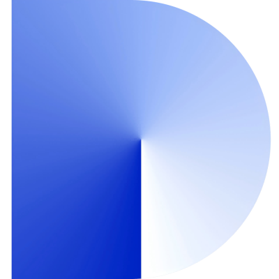

<h1 align="center">
  Hi there 👋, I'm Bikeread!
</h1>

  <em>A versatile Software Engineer with a passion for building innovative solutions and a knack for efficient development.</em>
   
  <em>Proficient in Java, Python, and modern web technologies, with expertise in cloud platforms and containerization.</em>

---

### 💡 About Me

> I'm driven by the challenge of solving complex problems and crafting elegant, scalable software. My journey in tech has led me to explore a diverse range of tools and platforms, always seeking the most effective ways to bring ideas to life.

*   💻 My core languages are **Java** and **Python**, and I'm adept at building full-stack applications with **Vue.js**, **JavaScript**, and **Flask**.
*   🛠️ I'm a long-term member and proficient user of **Cursor**, leveraging its AI capabilities to accelerate my development workflow.
*   🧩 I actively contribute as a **plugin developer for Dify**, extending its functionalities and empowering the community.
*   ☁️ Experienced with cloud services on **AWS** and **Azure**, and skilled in containerization with **Docker** and orchestration with **Kubernetes (k8s)**.
*   🗄️ Proficient with both relational (**MySQL**) and NoSQL (**MongoDB**) databases.
*   🚀 I’m always eager to learn new technologies and contribute to exciting open-source projects.
*   💬 Feel free to ask me about anything related to my tech stack, AI-assisted development, or building LLM applications!

---

### 📊 My GitHub Stats & Activity

  
  

  

---

### 🛠️ My Core Tech Stack

  **Languages & Frameworks:**
  

    
    
    
    
    
  

  **Databases:**
  

    
    
  

  **DevOps & Cloud:**
  

    
    
    
    
  

---

### 🚀 Specializations & Contributions

<table align="center">
  <tr>
    <td align="center" width="50%">
      <a href="https://cursor.sh/" target="_blank" rel="noreferrer">
         
        <strong>Cursor Power User</strong>
      </a>
      
<em>Long-term member, leveraging AI for enhanced coding efficiency and productivity.</em>

    </td>
    <td align="center" width="50%">
      <a href="https://dify.ai/" target="_blank" rel="noreferrer">
        <!-- 假设 Dify 的 Logo (你需要找到一个合适的 Dify logo URL) -->
         
        <strong>Dify.AI Plugin Developer</strong>
      </a>
      
<em>Contributing to the Dify ecosystem by developing and enhancing plugins.</em>

    </td>
  </tr>
</table>

  <em>Thanks for visiting my profile!</em>  
  ⭐️ From <a href="https://github.com/bikeread" target="_blank">bikeread</a>

