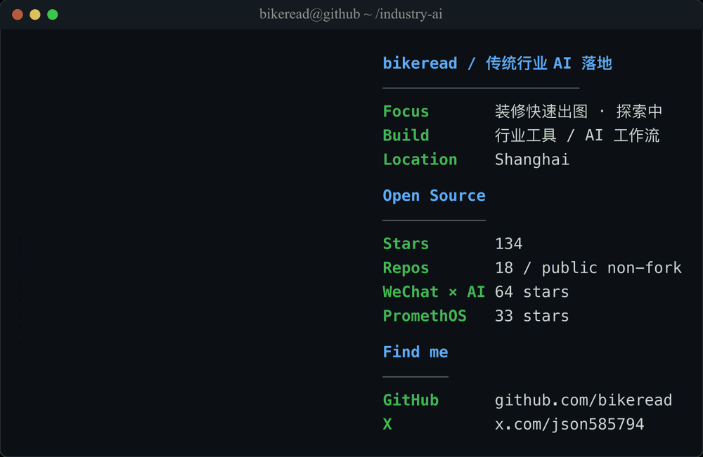

<picture>
  <source media="(prefers-reduced-motion: reduce)" srcset="./assets/profile.png">
  
</picture>

  <a href="https://x.com/json585794"><code>X ↗</code></a> ·
  <a href="https://github.com/bikeread?tab=repositories"><code>Projects ↗</code></a> ·
  <a href="https://x.com/json585794"><code>聊聊行业里的实际问题 ↗</code></a>

开源数据：2026-10-08，公开非 Fork 仓库。头像字符画基于 <a href="https://github.com/saivarun1410/termfetch">Termfetch</a>；<a href="./assets/NOTICE.md">视觉来源与说明</a>。
